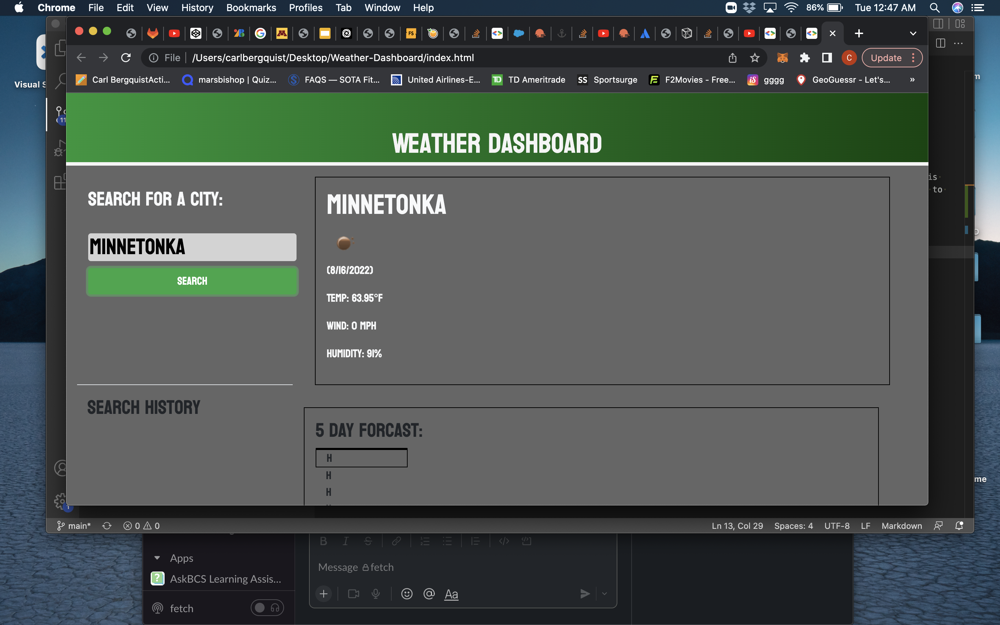

# Weather-Dashboard

## Contributors

Carl Bergquist

## Usage

The weather dashboard is designed to pull current weather from the requested search using the openweatherapi. It is also suppose to display a 5 day forcast and store and display the history of the searches, however I was not able to get to this in time. I will update this in the future.

## Screenshot

## Link to Application

[Carl Bergquist link](https://carlbergquist.github.io/Portfolio/)